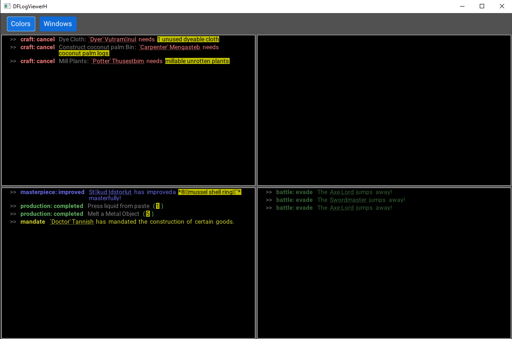
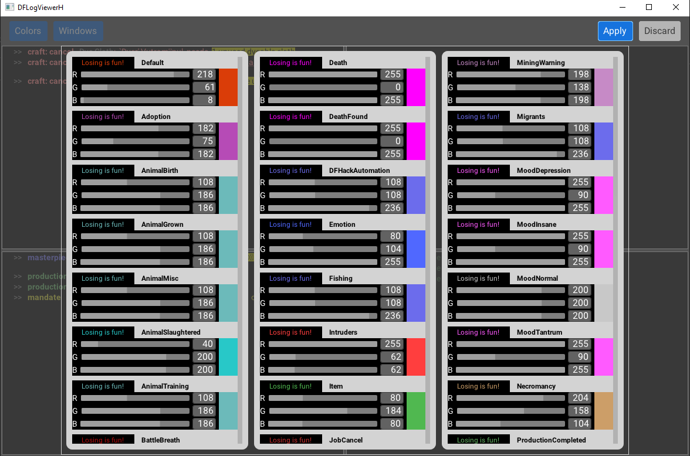
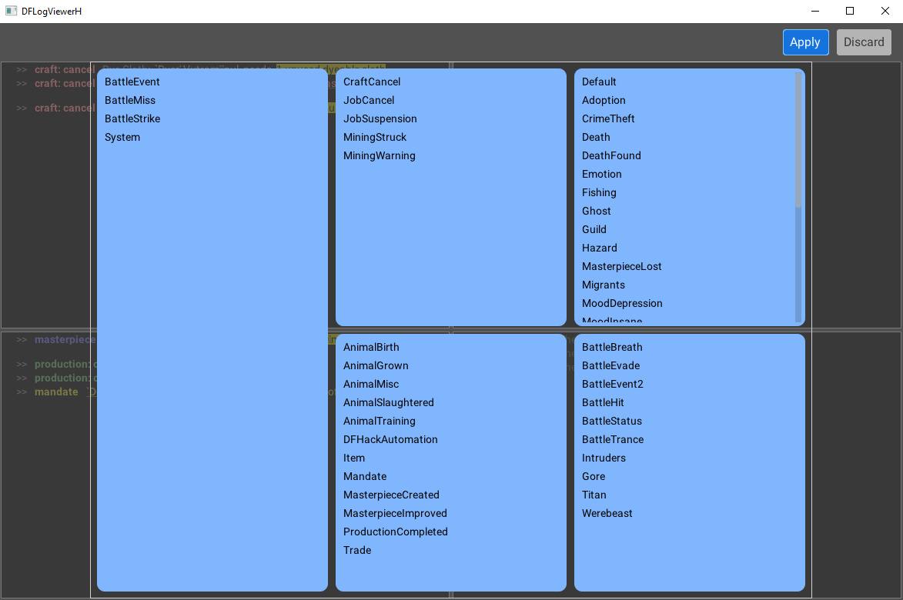

# df-log-viewer-h

Convenient (hopefully) viewer for announcements of 
[Dwarf Fortress game](http://www.bay12games.com/dwarves/) .

Distinctive features:
- up to 4 log windows
- parsing and decomposition of dwarf names on components 
    (nickname, name, profession); display options
- grouping log entries by type (tag)
- moving all log entries of the type from one window to another
- possibility to hide all log entries of the type
- changing log entries color
- a wide variety of possible log display configurations

The app heavily relies on Francisco Vallarino's
[Monomer framework](https://github.com/fjvallarino/monomer), 
and in principle, it can run on Windows, Linux, and macOS.

## Installation

To build from source, follow similar 
[instructions](https://github.com/fjvallarino/monomer/blob/main/docs/tutorials/00-setup.md) 
as for Monomer.

On Windows you can use 
[this package with binary](https://drive.google.com/file/d/11teNPY7dQbf0PWJwYPqMBFyVDcfpCRPL/view?usp=sharing).

Folder with dflv(.exe) and configaration files can be placed in 
PeridexisErrant's Starter Pack utilities folder. In this case 
app will try to find gamelog.txt on its own.

Alternatively, you can specify the path to gamelog.txt in dflv.yaml
or on the command line of the program dflv(.exe).

Further installation instructions can be found in install.txt file in
the distribution directory (DFLogViewerH).

## Fonts

You can specifiy your own fonts; place them in assets folder,
and specify fonts' filenames in dflv.yaml. By default, the app use 
[Roboto](https://fonts.google.com/specimen/Roboto) fonts family,
licensed under the [Apache license](http://www.apache.org/licenses/LICENSE-2.0).

Correctness of word wrapping in log windows for other fonts is not tested.

## Screenshots

